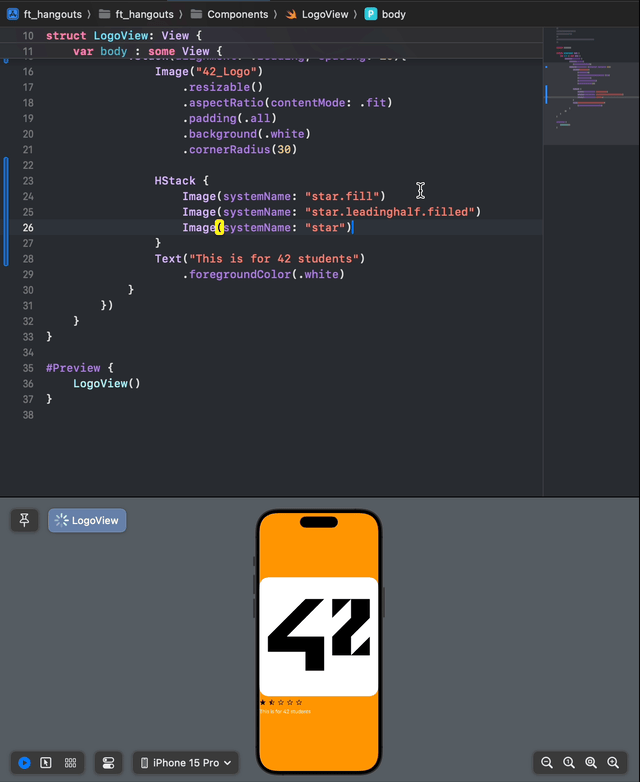
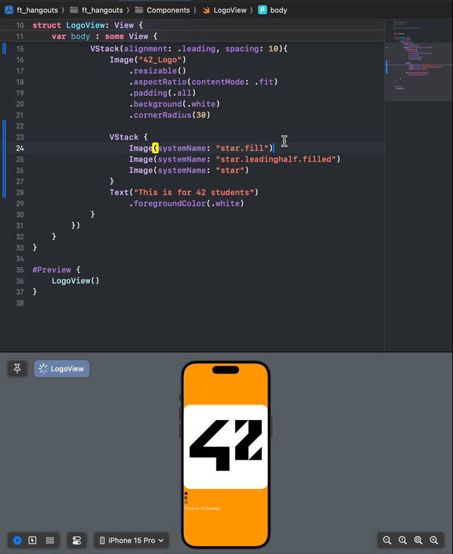
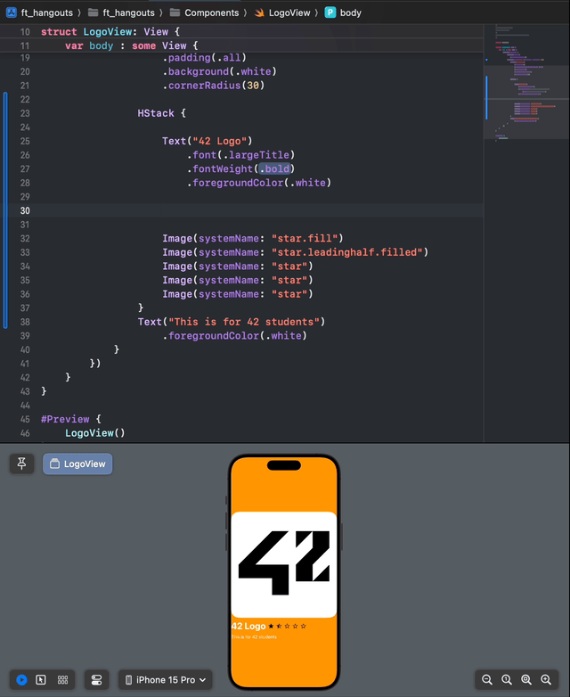
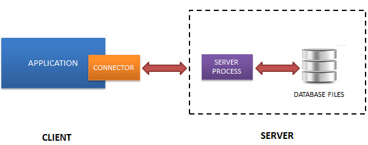
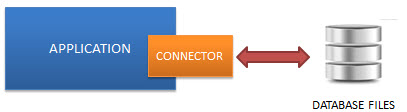
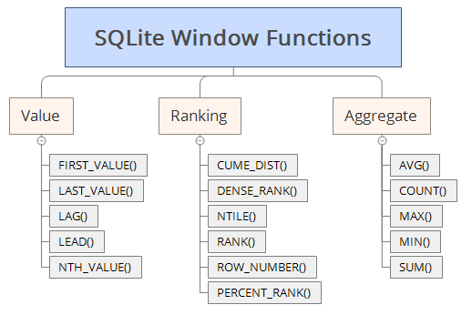

# IOS 로 시작하기

## IOS SDK(Software Development Kit)

ios 를 개발하기 위해선 xcode 가 필요하다.

## VIEW

결국은 화면이란 가로와 세로로 표현되기 때문에

가로와 세로를 잘 나누어 이용해주면 모든 화면에 표현이 가능하다 (z축도 있지만 나중에)

### HStack(Horizontal Stack)



수평으로 작성이 가능하게 만들어 준다.
가로의 크기를 나누어 준다

### VStack(Vertical Stack)



수직으로 작성이 가능하게 만들어 준다.
세로로 크기를 나누어 준다

이 2속성을 사용하여 화면의 ```Layout```을 잘 나누어 표현하면 된다.

> [!TIP]
> ZStack(Depth Stack) Z축으로 만들어 준다\
> 화면을 곂곂이 쌓으는게 가능해 진다\
> css 부터```z-index```로 사용되어왔기에 Z로 작성되는거 같다

### Spacer



사이 공간을 채우는대 사용된다
```auto-margin```과 비슷해 보인다

### SQLite

ios 는 SQLite가 내장되있다

필자의 버전에서는

```objc
import SQLite3
```

를 사용할 수 있었고 이것에 대하여 알아보려 한다

SQLite?? 왜 사용할까??

서버가 없이도 돌아가는 방식을 사용한다.\
그대신에 기기의 폴더에 db 데이터를 저장하고 또한 sql이 돌아갈 메모리도 줘야한다.

| 보통 SQL | SQLite |
| -- | -- |
| | |

그럼 장점이 뭐냐??

외부 서버가 없어두 된다~\
안에서 처리하기 떄문에 댕 빠르다~\
내맘데로 기기에 따라 커스텀된다

단점

외부 서버가 없어 임의로 사용자가 데이터를 수정할 수 있다\
공통으로 사용하면 음!! 서로 이상할 수 있다

SQL Lite library에 대한 자세한 설명은

링크 : [QSLite](./SQLite)

그리고 튜토리얼은

링크 : [https://www.sqlitetutorial.net/](https://www.sqlitetutorial.net/)

여기서 좀 외워야 할것 들이 있고 tip 을 적어본다

like 에서\
%로 wildcard를 쓸수 있다\
문자 앞 혹은 뒤에 %를 넣으면 문자와 일치하고 %부분에 앞 혹은 뒤는 달라도 가져오게 된다\
그럼으로 %문자는??? 이스케이프를 사용하여 지정해주어야한다

앞 무시

```sql
SELECT c
FROM t
WHERE c LIKE '%앞은무시해'
-- 뒤 무시
SELECT c
FROM t
WHERE c LIKE '뒤는무시해%'
-- 앞뒤 무시
SELECT c
FROM t
WHERE c LIKE '%양쪽무시해%'
-- % 검증에 넣기
SELECT c 
FROM t 
WHERE c LIKE '%10\%%' ESCAPE '\';
```

glob 라는 비슷한 애도 있는데 뭔가 정규식?? 을 사용할 수 있게 하는건가??\
패턴을 참조할 수 있다고 한다

sql을 좀 비교해볼까

```sql
-- 테이블 만들기
CREATE TABLE artists (
   ArtistId INTEGER PRIMARY KEY AUTOINCREMENT,
   Name NVARCHAR
);
-- 값 넣기
INSERT INTO artists (name)
VALUES
    ("Buddy Rich"),
    ("Candido"),
    ("Charlie Byrd");
-- 수정 하기
UPDATE artists
SET Name = 'Toronto'
WHERE
    Name = "Buddy Rich";
-- 삭제하기
DELETE FROM artists
WHERE Name = "Candido";
```

> [!TIP]
> ```CREATE TABLE IF NOT EXISTS tablename``` 으로 검증하면서 만드는게 좋다

\
문자열 함수들인데 한번 보는게 좋은거같다 [https://www.sqlitetutorial.net/sqlite-string-functions/](https://www.sqlitetutorial.net/sqlite-string-functions)

대충 알아봤으니 이제 코드에서 사용해 보자

#### SQLite 시작

---

오픈

```objc
public func sqlite3_open_v2(_ filename: UnsafePointer<CChar>!, _ ppDb: UnsafeMutablePointer<OpaquePointer?>!, _ flags: Int32, _ zVfs: UnsafePointer<CChar>!) -> Int32
```

이함수로 오픈을 할 것이다

```objc
public func sqlite3_prepare_v2(_ db: OpaquePointer!, _ zSql: UnsafePointer<CChar>!, _ nByte: Int32, _ ppStmt: UnsafeMutablePointer<OpaquePointer?>!, _ pzTail: UnsafeMutablePointer<UnsafePointer<CChar>?>!) -> Int32
```

이것으로 명령 cmd 를 전송할 것 이고

```objc
public func sqlite3_finalize(_ pStmt: OpaquePointer!) -> Int32
```

이함수로 정상 적으로 객체를 해채시킬 것이다

> [!WARNING]
> 해체 시키지 않을경우 ```memory leak```이 발생 할 수 있슴

#### SQLite open

```sqlite3_open_v2``` 이 권장 사항이였음으로 이것을 사용할 것이고\
open을 하기전에 ```sqlite3_temp_directory()``` 함수를 사용하여 폴더를 지정 하는것을 추천하였다 하지만 기본적으로 폴더를 지정해 준다고 하니 스킵하겟다

```objc

```


DB 설정

테이블 만들기

```sql
CREATE TABLE IF NOT EXISTS Contacts (
    id INTEGER PRIMARY KEY AUTOINCREMENT,
    first_name TEXT,
    last_name TEXT,
    image BLOB,
    phone_number TEXT UNIQUE NOT NULL,
    create_date DATE DEFAULT CURRENT_TIMESTAMP NOT NULL,
    update_date DATE DEFAULT CURRENT_TIMESTAMP NOT NULL,
    CHECK (phone_number GLOB '010-[0-9][0-9][0-9][0-9]-[0-9][0-9][0-9][0-9]')
)
```

데이터 설명

| column | type | 설명 |
| :-- | :-- | :-- |
| id | INTEGER PRIMARY KEY AUTOINCREMENT | 고유 id 값이다 |
| first_name | TEXT | 이름 |
| last_name | TEXT | 이름 |
| image | BLOB | 이미지 |
| phone_number | TEXT UNIQUE NOT NULL | 폰넘버 이건 조건을 주어 좀 재대로 확인한다 그리고 유니크를 주며 번호가 겹치지 않게 하였다|
| create_date | DATE DEFAULT CURRENT_TIMESTAMP NOT NULL | 만든 날짜 |
| update_date | DATE DEFAULT CURRENT_TIMESTAMP NOT NULL | 업데이트된 날짜 |

조건

| column | 조건 |
| :-- | :-- |
| phone_number | ```010-[0-9]{4}-[0-9]{4}``` 를 만족하게 만들었다 |

트리거

```sql
CREATE TRIGGER updateContacts
AFTER UPDATE ON Contacts
FOR EACH ROW
BEGIN
    UPDATE Contacts
    SET (create_date, update_date) = (old.create_date, CURRENT_TIMESTAMP)
    WHERE phone_number = new.phone_number;
END
```

| trigger | 조건 | 설명 |
| :-- | :-- | :-- |
| updatedate | AFTER UPDATE ON Contacts | Contacts 값이 업데이트 되면 ```update_data``` column이 최신으로 업데이트 된다 |


```sql
INSERT INTO Contacts (first_name, last_name, phone_number)
VALUES ('John', 'Doe', '010-1234-4678');
```

```sql
UPDATE Contacts
SET first_name = 'Jane',
    last_name = 'Smith'
WHERE phone_number = '010-9876-5432';
```
